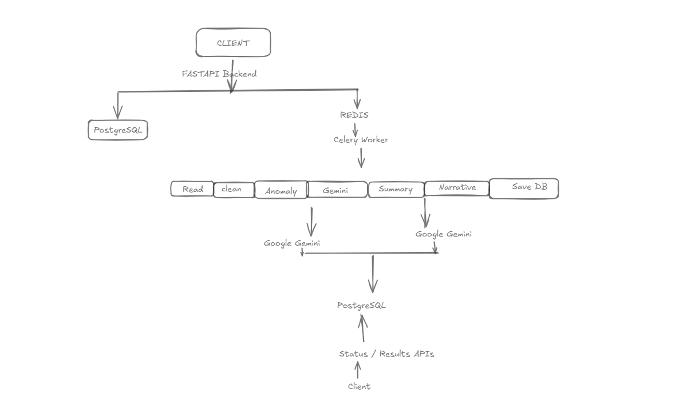
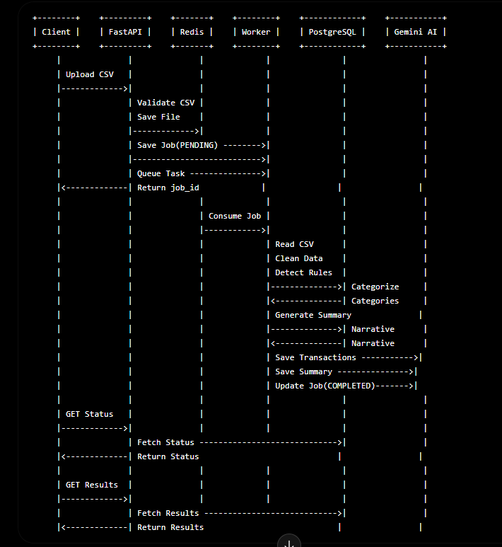

# 🚀 AI Transaction Processing Pipeline

<p align="center">


</p>

---

## 📌 Project Overview

The **AI Transaction Processing Pipeline** is a production-inspired backend system that processes financial transaction CSV files asynchronously using **FastAPI**, **Celery**, **Redis**, **PostgreSQL**, and **Google Gemini AI**.

Instead of processing uploaded files synchronously, every upload creates a background job. A Celery worker consumes the task, cleans the transaction data, detects anomalies, classifies merchants using Gemini AI, generates financial summaries, creates an executive narrative, and stores the processed results in PostgreSQL.

The client can monitor the job status using REST APIs and retrieve the complete processed report once the background job finishes.

This architecture closely resembles enterprise-scale financial processing systems where long-running operations must execute asynchronously without blocking client requests.

---

# ✨ Features

### 📂 CSV Processing

- Upload financial transaction CSV files
- Background processing using Celery
- Job tracking
- Asynchronous execution

---

### 🧹 Intelligent Data Cleaning

- Remove duplicate transactions
- Handle missing values
- Normalize date formats
- Normalize currency values
- Data validation

---

### 🚨 Rule-Based Anomaly Detection

Automatically detects transactions based on:

- High Amount Transactions
- Failed Transactions
- Weekend Transactions
- Refund Transactions
- Foreign Currency Transactions
- Suspicious Notes

---

### 🤖 AI-Powered Merchant Categorization

Google Gemini AI automatically classifies merchants into categories such as:

- Food
- Shopping
- Travel
- Entertainment
- Healthcare
- Utilities
- Investment
- Bills
- Salary
- Transfer
- Other

---

### 📊 Financial Summary Generation

Automatically computes

- Total Spend (INR)
- Total Spend (USD)
- Top Merchants
- Category Breakdown
- Total Anomalies
- Financial Risk Level

---

### 📝 Executive Narrative Generation

Gemini AI generates an executive financial summary describing

- Spending behavior
- Major expense categories
- Financial insights
- Risk assessment
- Overall spending pattern

---

### 📡 REST APIs

- Upload CSV
- Check Job Status
- Retrieve Processing Results
- List Jobs

---

### 🐳 Dockerized

Entire application can be started using

- Docker
- Docker Compose

with a single command.

---

# 🛠 Tech Stack

| Category | Technologies |
|-----------|--------------|
| Backend | FastAPI |
| Language | Python 3.12 |
| Database | PostgreSQL |
| ORM | SQLAlchemy |
| Background Processing | Celery |
| Queue | Redis |
| AI | Google Gemini 2.5 Flash |
| Data Processing | Pandas |
| Database Migration | Alembic |
| Containerization | Docker |
| API Documentation | Swagger UI |
| Testing | Pytest |

---

# 📂 Project Structure

```text
ai-transaction-processing-pipeline
│
├── app
│   ├── api
│   ├── core
│   ├── db
│   ├── models
│   ├── repositories
│   ├── schemas
│   ├── services
│   │     ├── ai
│   │     ├── anomaly
│   │     ├── cleaning
│   │     ├── jobs
│   │     └── summary
│   │
│   ├── workers
│   └── main.py
│
├── alembic
├── architecture
│   ├── architecture.png
│   └── transaction-processing-flow.png
│
├── docker
├── tests
├── uploads
│
├── Dockerfile
├── docker-compose.yml
├── requirements.txt
└── README.md
```

---

# 🏗 System Architecture

The following architecture illustrates how the application components communicate with each other.

<p align="center">



</p>

---

# 🔄 Transaction Processing Flow

The following diagram illustrates the complete processing lifecycle from CSV upload to AI-generated financial report.

<p align="center">



</p>

---

# ⚙️ Processing Pipeline

```

                 Client

                    │

                    ▼

          POST /jobs/upload

                    │

                    ▼

              FastAPI Server

                    │

        Validate Uploaded CSV

                    │

                    ▼

             Save Uploaded File

                    │

                    ▼

          Create Job (PENDING)

                    │

                    ▼

        Publish Task to Redis Queue

                    │

                    ▼

              Celery Worker

                    │

        ─────────────────────────

            Read CSV File

                    │

            Clean Dataset

                    │

      Rule-Based Anomaly Detection

                    │

    Gemini Merchant Categorization

                    │

     Financial Summary Generation

                    │

     Executive Narrative Generation

                    │

      Persist Results to Database

                    │

        Update Job Status

                    │

        ─────────────────────────

                    │

          GET Status API

          GET Results API

                    │

                    ▼

                 Client

```

---

# 📈 High-Level Workflow

1. Client uploads a CSV file.
2. FastAPI validates the uploaded file.
3. Job metadata is stored in PostgreSQL.
4. CSV file is saved locally.
5. A Celery task is published to Redis.
6. Celery Worker consumes the task.
7. Transactions are cleaned.
8. Anomalies are detected.
9. Gemini categorizes merchants.
10. Financial summary is generated.
11. Executive narrative is generated.
12. Processed data is saved to PostgreSQL.
13. Job status becomes **COMPLETED**.
14. Client fetches the results using REST APIs.

---

# 🚀 Getting Started

## Prerequisites

Before running the project, ensure the following software is installed on your machine.

| Software | Version |
|----------|----------|
| Python | 3.12+ |
| PostgreSQL | 16+ |
| Redis | 7+ |
| Docker | Latest |
| Docker Compose | Latest |
| Git | Latest |

---

# 📥 Clone Repository

```bash
git clone https://github.com/<your-github-username>/ai-transaction-processing-pipeline.git

cd ai-transaction-processing-pipeline
```

---

# 📦 Install Dependencies

Create a virtual environment.

```bash
python -m venv .venv
```

Activate the environment.

### Windows

```powershell
.venv\Scripts\activate
```

### Linux / macOS

```bash
source .venv/bin/activate
```

Install all required packages.

```bash
pip install -r requirements.txt
```

---

# ⚙️ Environment Variables

Create a `.env` file in the project root.

```env
APP_NAME=AI Transaction Processing Pipeline

DATABASE_URL=postgresql://postgres:<password>@localhost:5432/transaction_db

REDIS_URL=redis://localhost:6379/0

UPLOAD_DIR=uploads

GEMINI_API_KEY=<YOUR_GEMINI_API_KEY>

GEMINI_MODEL=gemini-2.5-flash
```

---

## 🐳 Docker Environment

When running inside Docker, create a separate `.env.docker`.

```env
APP_NAME=AI Transaction Processing Pipeline

DATABASE_URL=postgresql://postgres:<password>@postgres:5432/transaction_db

REDIS_URL=redis://redis:6379/0

UPLOAD_DIR=uploads

GEMINI_API_KEY=<YOUR_GEMINI_API_KEY>

GEMINI_MODEL=gemini-2.5-flash
```

---

# 🗄 Database Migration

Generate the migration.

```bash
alembic revision --autogenerate -m "Initial migration"
```

Apply all migrations.

```bash
alembic upgrade head
```

---

# ▶️ Running the Project (Local Development)

## Step 1

Start PostgreSQL.

---

## Step 2

Start Redis.

```bash
redis-server
```

---

## Step 3

Run FastAPI.

```bash
uvicorn app.main:app --reload
```

---

## Step 4

Start Celery Worker.

```bash
celery -A app.workers.celery_app worker --loglevel=info
```

---

## Step 5

Open Swagger UI.

```
http://127.0.0.1:8000/docs
```

---

# 🐳 Running with Docker

Build all images.

```bash
docker compose build
```

Start all services.

```bash
docker compose up -d
```

Check running containers.

```bash
docker compose ps
```

View logs.

```bash
docker compose logs -f
```

Stop containers.

```bash
docker compose down
```

Rebuild after changes.

```bash
docker compose up --build
```

---

# 📦 Docker Services

The application consists of four containers.

| Container | Purpose |
|------------|----------|
| transaction-api | FastAPI Backend |
| transaction-worker | Celery Worker |
| transaction-postgres | PostgreSQL Database |
| transaction-redis | Redis Message Broker |

---

# 🌐 API Documentation

Once the application is running, Swagger UI is available at:

```
http://127.0.0.1:8000/docs
```

Interactive API documentation allows you to:

- Upload CSV files
- Track background jobs
- Retrieve processing results
- Explore request and response schemas

---

# 🔑 Available REST APIs

| Method | Endpoint | Description |
|----------|-------------------------|-----------------------------|
| GET | `/health` | Health Check |
| POST | `/jobs/upload` | Upload CSV |
| GET | `/jobs/{job_id}/status` | Get Job Status |
| GET | `/jobs/{job_id}/results` | Get Processing Results |
| GET | `/jobs` | List Uploaded Jobs |

---

# 📤 Upload CSV

Uploads a CSV file and creates a background processing job.

### Request

```http
POST /jobs/upload
```

### Response

```json
{
  "job_id": "8f2f3c0e-6e5b-43f8-bdcf-b3dbf0fbdb1",
  "status": "PENDING",
  "message": "File uploaded successfully."
}
```

---

# 📊 Get Job Status

Returns the current status of the processing job.

### Request

```http
GET /jobs/{job_id}/status
```

### Sample Response

```json
{
  "job_id": "8f2f3c0e-6e5b-43f8-bdcf-b3dbf0fbdb1",
  "status": "COMPLETED",
  "row_count_raw": 95,
  "row_count_clean": 67,
  "created_at": "2026-07-01T21:28:28",
  "completed_at": "2026-07-01T21:28:33",
  "error_message": null
}
```

---

# 📈 Get Processing Results

Returns the complete processed financial report.

### Request

```http
GET /jobs/{job_id}/results
```

The response contains:

- Processed Transactions
- AI Merchant Categories
- Financial Summary
- Executive Narrative
- Category Breakdown
- Top Merchants
- Risk Assessment
- Anomaly Details

---


# 🧠 AI Integration

The application leverages **Google Gemini 2.5 Flash** to enrich raw financial transaction data with intelligent insights.

AI is utilized in two key stages of the processing pipeline:

---

## 1️⃣ Merchant Categorization

Instead of relying on manually maintained mapping tables, the system sends merchant names to Gemini AI in batches for classification.

Example merchants:

- Amazon
- Swiggy
- Flipkart
- Ola
- IRCTC
- Apollo Pharmacy

Gemini classifies each merchant into one of the predefined categories:

| Merchant | Category |
|-----------|----------|
| Amazon | Shopping |
| Swiggy | Food |
| Flipkart | Shopping |
| Ola | Travel |
| IRCTC | Travel |
| Apollo Pharmacy | Healthcare |

The categorization service implements:

- Batch Processing
- Retry Mechanism (3 Attempts)
- JSON Validation
- Graceful Fallback Handling

---

## 2️⃣ Executive Narrative Generation

Once the entire transaction dataset has been processed, Gemini AI generates an executive-level financial summary.

The generated narrative highlights:

- Overall spending
- Major expense categories
- Top merchants
- Financial observations
- Risk assessment
- Spending behavior

This enables non-technical users to understand their financial activity without manually analyzing raw transaction records.

---

# 🚨 Rule-Based Anomaly Detection

The system automatically identifies suspicious or noteworthy transactions using predefined business rules.

Current anomaly rules include:

| Rule | Description |
|------|-------------|
| High Amount | Amount exceeds configured threshold |
| Failed Transaction | Transaction status is FAILED |
| Weekend Transaction | Transaction occurred on Saturday or Sunday |
| Refund Transaction | Notes contain REFUND |
| Foreign Currency | Currency is not INR |
| Suspicious Notes | Notes contain the keyword SUSPICIOUS |

Each detected anomaly is stored together with the reason, allowing downstream systems or users to investigate unusual transactions.

---

# 📊 Financial Summary Generation

After processing all transactions, the system computes aggregate insights, including:

- Total Spend (INR)
- Total Spend (USD)
- Top Merchants
- Merchant Category Distribution
- Total Number of Anomalies
- AI Generated Executive Narrative

These summaries are persisted in PostgreSQL and exposed through the Results API.

---

# 🗃 Database Design

The application uses PostgreSQL as the primary data store.

### Jobs Table

Stores metadata for every uploaded CSV processing job.

Fields include:

- Job ID
- Filename
- Status
- Row Count (Raw)
- Row Count (Clean)
- Created Timestamp
- Completed Timestamp
- Error Message

---

### Transactions Table

Stores cleaned and enriched transaction records.

Fields include:

- Transaction ID
- Job ID
- Merchant
- Category
- Amount
- Currency
- Date
- Status
- Notes
- Anomaly Flag
- Anomaly Reason

---

### Job Summary Table

Stores aggregated insights for each processing job.

Includes:

- Total Spend
- Top Merchants
- Category Breakdown
- Total Anomalies
- AI Narrative

---

# 📷 Application Screenshots

The following screenshots demonstrate the application workflow.

## Swagger UI

> Add screenshot

```
screenshots/swagger-ui.png
```

---

## Upload CSV

> Add screenshot

```
screenshots/upload-api.png
```

---

## Job Status

> Add screenshot

```
screenshots/job-status.png
```

---

## Processing Results

> Add screenshot

```
screenshots/results-api.png
```

---

## Docker Containers

> Add screenshot

```
screenshots/docker-containers.png
```

---

# 🧪 Testing

The project has been tested for the following scenarios:

- CSV Upload Validation
- Background Job Execution
- Data Cleaning
- Anomaly Detection
- Merchant Categorization
- Financial Summary Generation
- Executive Narrative Generation
- Job Status Retrieval
- Job Results Retrieval
- Dockerized Deployment

---

# 📈 Future Enhancements

The project can be extended with several enterprise-grade features:

- JWT Authentication & Authorization
- Role-Based Access Control (RBAC)
- Multi-tenant Architecture
- Kafka Event Streaming
- Kubernetes Deployment
- Prometheus Metrics
- Grafana Dashboards
- OpenTelemetry Distributed Tracing
- Object Storage (AWS S3 / MinIO)
- Email Notifications
- WebSocket Progress Updates
- ML-Based Fraud Detection
- Elasticsearch for Transaction Search
- CI/CD Pipeline using GitHub Actions

---

# 💡 Key Learning Outcomes

This project demonstrates practical implementation of:

- Asynchronous Background Processing
- Distributed Task Queues
- REST API Design
- Docker Containerization
- PostgreSQL Data Modeling
- Repository Pattern
- Service Layer Architecture
- AI Integration using Google Gemini
- Rule-Based Analytics
- Financial Data Processing
- Production-Style Backend Development

---

# 🤝 Contributing

Contributions are welcome.

If you would like to improve this project:

1. Fork the repository
2. Create a new feature branch
3. Commit your changes
4. Push to your fork
5. Open a Pull Request

---

# 📄 License

This project is licensed under the MIT License.

---

# 👨‍💻 Author

**Yash Chauhan**

Backend & DevOps Engineer

GitHub: https://github.com/yashdotdev13

LinkedIn: https://www.linkedin.com/in/yash-chauhan-a415b6246/

---

# ⭐ Support

If you found this project helpful, consider giving it a ⭐ on GitHub.

It helps others discover the project and motivates future improvements.

---

## 🙏 Acknowledgements

This project was built using the following technologies and communities:

- FastAPI
- SQLAlchemy
- PostgreSQL
- Redis
- Celery
- Docker
- Google Gemini AI
- Pandas
- Alembic
- Python Community